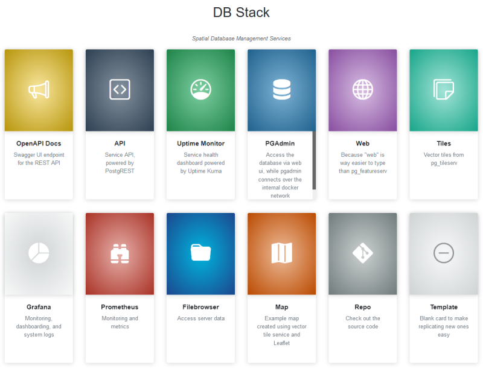

# DBStack

The Spatial DBStack is a simple and opinionated docker-compose based stack for PostgreSQL that provides an enterprise-ready database solution with additional stack components for monitoring, administration, and publication.

Development is focussed on providing an easy to use spatial database services that is secure by default and provides enough functionality OOTB to allow sophisticated spatial applications to be developed without wrangling infrastructure or architecture.

> **Pre-Alpha warning**: this will eat your homework

It's optimized for utilization with spatial data by providing spatial service APIs, and is based on the [kartoza/docker-postgis](https://github.com/kartoza/docker-postgis) image.

For the most part, dbstack will be used to refer to the project, but the repo name spatial-dbstack was used to explicitly outline it's intended purpose as a spatial datastore.



## Installation

Note that `setup.sh` will be configured to provide a setup wizard for users to configure environment variables and passwords accordingly.

For the time being, simply copy and modify the `.env.example` file as `.env`, then run `docker-compose up -d`. Note that a number of passwords will need to be reconfigured on deploy.

A basic server setup script for ubuntu/ debian (note that this is not a silver bullet) is available for initial configuration:

`sudo curl -s https://raw.githubusercontent.com/zacharlie/spatial-dbstack/main/provision.sh | bash -s`

The `wireguard.sh` script can also be modified with your client machines public wireguard key and allowed IP range and then run to configure vpn access to the server.

Remember to copy your ssh key to the server and disable password authentication:

`ssh-copy-id -i ~/.ssh/id_rsa.pub USER@SERVER_IP`

`sudo nano /etc/ssh/sshd_config`

```text
PasswordAuthentication no
```

`service ssh restart`

## Authorization

For the nginx authorization system to work, an authorization file `config/nginx/webusers` contains user credentials, generated with htpasswd.

A new password can be generated using the command `sudo htpasswd -c ./webusers <username>`. Note that htpasswd may require installation (`apache2-utils` for debian, `httpd-tools` for rhel etc).

Default Username-Password Combo:

`dbstack` `vZLqAMychaH4nBwfOtTb`

Change these please. Note that the uptime service stores the password in the database and will need to be reset from the UI.

The Filebrowser username default is admin. This app doesn't allow configuration of the superuser account name with the config file.

## Known issues

- https://github.com/docker/compose/issues/8756
- https://github.com/grafana/loki/issues/2361
- https://github.com/louislam/uptime-kuma/issues/147

## Running uptime Kuma

It [may take a while](https://github.com/louislam/uptime-kuma/pull/1349) before new features are introduced to uptime kuma, but the implementation currently [requires a subpath](https://github.com/louislam/uptime-kuma/issues/147), for which there is an [open PR](https://github.com/louislam/uptime-kuma/pull/1092). The dockerfile can be built with `docker build . -f uptime-kuma-dockerfile -t custom/uptime-kuma` or `docker-compose up -d --build`, but it has to install lots of node modules etc so a discrete build is recommended.

Uptime-Kuma is pretty and easy to use, but it may well be necessary to switch to an alternative like [cabot](https://github.com/arachnys/cabot) or even [netdata](https://github.com/netdata/netdata) if the project development stalls or a work around is not found.

## Services

- nginx (proxy for all services, and enforces http basic auth by default)
- PostGIS (including pgrouting and other extensions)
- PostgREST (with swagger ui, exposes everything in the publish schema)
- postgraphile (includes GraphiQL interface)
- PGAdmin (easy access to db via web UI without exposing the db port publicly)
- Uptime Kuma (personal uptime robot)
- pg_featureserv (OGC features/ WFS3 API for everything in the publish schema)
- pg_tileeserv (Vector tiles for everything in the publish schema)
- Grafana (with prometheus and loki)
- Filebrowser (for file uploads and management)

## More services

This is a simple service for spinning up a PostGIS database with additional monitoring services and APIs for accessing the data.

It is not a full-featured Enterprise GIS platform. If you require additional features such as map publishing and a host of other utilities, check out the [OSGS project](https://github.com/kartoza/osgs) instead.

## Service resources

One great feature of the dbstack infrastructure is the configuration and sharing of preconfigured resources, such as dashboards, monitoring services, webmap templates. If you have a resource you think could be useful to others, feel free to make a PR and share it in the _resources_ directory.

## Implementation considerations

Although deploying the stack can be as simple as `docker-compose up -d`, it's worth noting that there are a number of caveats to running this system in production that can bite you if you don't know what you are doing.

### Architecture

The structure of the stack is a preconfigured set of services deployed with docker-compose.

Nginx acts as a proxy for all services, which communicate via http under the hood. This keeps things secure from outside traffic, but note that it does provide what is essentially a single point of failure, as if any of the upstream services go down, nginx may fail and take all the other services with it.

Access to all exposed services is controlled by the `nginx` service, which is configured to use the `config/nginx/webusers` file for authentication using http basic auth.

Individual services have additional authorization control which is typically controlled by environment variables, and occasionally by hard-coded configuration files. Some services, such as grafana, are configured to use the basic auth for the service auth. Reconfiguration (especially for sensitive data) is expected to be managed more effectively with the `setup.sh` in the near future.

### SSL and Auth

To prevent data leaks, the stack deploys with self signed certificates and http basic auth by default. Either of these functions may be modified in the Nginx config accordingly, and user supplied certificates should be supported in the near future.

Note that because these are untrusted certificates, many services will return errors when trying to connect. In many cases 9such as browsers) users may bypass this error manually.

Note that exposing the database port in the docker compose will use the db container ssl settings (snake-oil certificates by default).

### Backups

The docker-postgis image and db-backup containers store the data in named volumes accordingly. The backup image uses a tower of hanoi strategy, but that is of limited use when the backups are stored on the same server as the database. It's up to you to deploy a backup solution that syncs the db dumps to a backup location or object store.

### Docker ports and ufw

By default, docker tends to [ignore firewall rules such as those specified by ufw](https://github.com/docker/for-linux/issues/690), which means that if you expose a port on the docker service, it is exposed publicly regardless of firewall configuration. By default,

### Docker vs k8s

This stack is specifically designed to run on a Docker host with the docker compose system. For the vast majority of use cases involving spatial data at the organisational or regional level, this should be perfectly adequate. Unless you are a kubernetes expert, are using a managed service, or employ full time devops staff, simply run this system in docker and scale up your infrastructure.

If you are deploying to k8s infrastructure, these configurations can be configured as k8s resources, and in most instances the reverse proxy can be canned to have access managed by the ingress controller. If that sounds confusing, book a consultation with an expert instead.

[kartoza/docker-postgis](https://github.com/kartoza/docker-postgis) provides support for various replication services, although it still relies primarily on a single-master setup. Setting up communications between the databases (master/ replica) depends a lot on the infrastructure outline.

For most corporate spatial data infrastructures, this setup is sufficient and overkill/ complication of your database setup is going to hurt your operations at some point. That said, services like [patroni](https://github.com/zalando/patroni) and [supabase](https://github.com/supabase/supabase) are also built on postgresql and IIRC support postgis OOTB, so if you are planning on hyperscaling those services may be a better option.

### Container performance

Containers virtualize your infrastructure, so performance hits are obviously guaranteed against baremetal. If you have a need for more performance from the database, run that component on baremetal and you can still use components from this project to monitor it. A simple solution for this (provided the network infrastructure is managed appropriately) is to modify the docker-host machine to have an entry in the hosts config (or upstream dns) which points "db" to the database machine, which is how most of the services communicate with it over the docker internal network.

### Other database systems

This is very PostgreSQL specific, and a number of the services support postgresql specific geodata (e.g. pg_tileserv). Using FDW for other geometry/ geography types likely won't work effectively for all services, and some ETL between data types and WKB can be expected as a requirement. If you want geodata services on top of another DBMS then you may have to configure services like geoserver yourself. YMMV.

TL;DR: Use PostgreSQL.

## Sample geodata binaries in the repo

I have included some geodata binaries I am using for demo production. Don't add more or change any. I will trim these down and purge them from the git filesystem later if/ when there are more significant users or contributors. Future plan is to have samples available in releases for download, and tiny subsets included in git for demos.

## Roadmap

More services can be added, and maybe profiles can be configured at a later stage, much like the initial implementation of the [OSGS](https://github.com/kartoza/osgs). Prettier demos would be nice too, so make an issue or PR if you have an idea.

At this point in time, meaningful templates and dashboards for graphana are highly desirable.

Before it gets to a 0.1 release, the following changes are intended:

- Complete a functional version of setup.sh that handles config and secrets properly
- Replace nginx system with traefik for reverse proxy
- Properly configure SSL using setup option of self signed, letsencrypt, or use certs
- Fix up container logging using promtail
- Include [postgres_exporter](https://github.com/prometheus-community/postgres_exporter) for db metrics monitoring (and example of including custom pg extensions)
- Include db function for calling data importing processes
- Include geodata file watcher (container and change detection process) for automating geodata and csv imports
- Handling raster data as an API - probably with titiler and pg_stac
- SSO/ login service with [authelia](https://www.authelia.com/)
- Creation of appropriate roles and users for SSO (Admin/ RO/ RW) with service integration
- Probably replace the landing page with something more useful, like [dashy](https://github.com/Lissy93/dashy)
- Add [watchtower](https://github.com/containrrr/watchtower/). Typically I'm against anything that mounts to the docker socket, but considering the possible security benefits of watchtower running it's getting included.

The release after will focus on these steps:

- Add reasonable defaults for deployment config (container replicas etc)
- customise the postgresql schema search path, so that elements in "publish" rather than "public" are available by default
- Create a functional branding script which customises systems to reflect a corporate identity (where possible - this won't be magic)
- Create a functional cleanup.sh which purges example data and samples from the system to allow for a clean start
- Reasonable examples and sample resources that show how it can be effectively leveraged, extended, or further configured
- Fixup of sample data to a tiny subset reasonably supplied with git (don't want to depend on releases for app examples), including spatial & non-spatial functions, relations etc
- Profile configuration
- Meaningful documentation

Might include [cadvisor](https://github.com/google/cadvisor) or something similar for resource utilization, but it's probably redundant against other services and not sure how to run it as a value add without mounting system resources (which I'd like to avoid - I mean the default is sudo docker run?!). Might still be useful in userspace with perf. Will test.

Will there be inclusion of an admin ui like portainer? Unlikely - doesn't make sense to make a docker compose stack depend on a particular orchestrator. Might add docs for those who want to use it that way. Will I build an admin UI like OSGS Admin? Maybe. If I get the time. That can do a bunch of config stuff that provides a UI for the setup.sh (in a reconfigurable way) at least.

Will there be caching services included? Unlikely - this is a database deployment, not a web gis system. Setting up geowebcache/ mapproxy/ whatever should be done in front of this service.

> An important issue which needs resolution is configuring the database allowed connections effectively. 0.0.0.0/0 is less than ideal for production, even in airgapped environments, and is typically outright dangerous.

Another issue is finding an elegant solution for managing container DNS, such that docker elements can be pointed to the upstream db when not included in the stack itself. The POSTGRES_HOST variable is not really a suitable replacement as it is currently used in limited places.

Some meaningful database settings should be configured for optimization (aside from providing an extra db-tune config), especially since it can reasonably be expected that spatial data will involve larger data types and rasters. Setting up connection poolers, verbose logging (and storing logs), and perhaps documenting an auditing process with something like [pgbadger](https://github.com/darold/pgbadger) could be highly valuable.

Profiles config may be more effective using bash in combination with docker profiles, as their is probably a lot of different config expected to happen. The initial "profiles" configuration should include:

- publish: publish everything in the publish schema and expose the db containers connection port to the network
- private: like publish but don't publish the db port
- public: like publish, but get rid of the publish schema and use "public" for services
- readonly: like publish, but configure services to only connect to a read only replica database instance
- dbless: use the services with a database server that is not a part of the docker-compose

A "complete", "monitoring", or "minimal" set of deployment options should also be specified which limits the services to only those that apply to a particular featureset.
